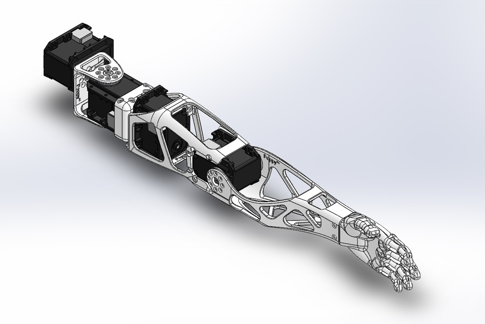
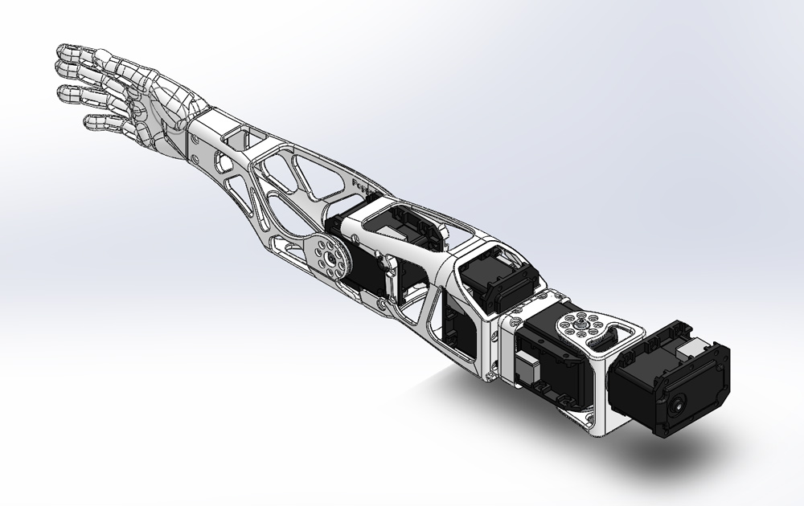

Poppy simple humanoid arms
===================

This Poppy module include CAD models and assemblies for 3D printable parts to create left and right basic 4 DoFs robotic humanoid arms.

It can be used for the [Poppy Humanoid](https://github.com/poppy-project/poppy-humanoid) or be freely included in any other robotic creatures if you find it relevant.

### Left arm:

### Right arm:

The design was done using Solidworks (2013-SP5) and is distributed with native formats. More format such as STEP and STL can be found in the [release](releases/) section.

## Open Source Hardware

All the technological development work made in the Poppy project is freely available under open source licenses. Only the name usage *"Poppy"* is restricted and protected as an international trademark, please contact us if you want to use it or have more information.

 **This work is licensed under a [Creative Commons Attribution-ShareAlike 4.0 International License](http://creativecommons.org/licenses/by-sa/4.0/).**
Please keep references to the Poppy project (www.poppy-project.org) and authors when you use or fork this work.

**Authors:** Matthieu Lapeyre, Alexandre Le Falher.

### Looking for the Solidworks files ?

We are using a GitHub feature called GIT LFS. It is great for versionning solidworks files but it stills lack basic features. If you download directly solidworks files from this web page, you will get an empty file...

You have two option:

1. Download the last official Solidworks version in the [release](https://github.com/poppy-project/Poppy-basic-arms/releases). You will also find STL, STEP and parasolid files.
- Clone locally this repository following [this guide](doc/cloning.md). This solution is only for people desiring to contribute or develop news hardware features for Poppy.

## Support
You need support ?
The [Poppy forum](forum.poppy-project.org) is the best (and single) place to ask for help !

## Setup

This module requires the [Robotis Library](https://github.com/matthieu-lapeyre/Robotis-library), which includes all Robotis components needed for the actuation of these arms.

## Contribute

### /!\ SolidWorks version
The SolidWorks policy sucks, they intentionnaly break compatibility between recent and older version. If you have a Solidworks older than 2013-SP0 you will certainly be able to open these parts but only as a read-only mode, which is equivalent to not beign able to open it...

Therefore, we won't upgrade our SolidWorks so more people can easily modify parts for their own uses.

For the same reason, we ask potential contributors wanting to pull work into official repository to downgrade (if needed) their solidworks version to 2013.

Accepting a pull-request from a Soldiworks >= 2014 will break whole compatibility.

## The Poppy project history

The Poppy project is born in 2012 in the [Flowers laboratory](flowers.inria.fr) at [Inria Bordeaux Sud-Ouest](http://www.inria.fr/en/centre/bordeaux).
It was initiated during [Matthieu Lapeyre](github.com/matthieu-lapeyre)'s PhD Thesis surpervised by [Pierre Yves Oudeyer](http://www.pyoudeyer.com/). At the beginning, the development team was composed by Matthieu Lapeyre (mechanics & design), [Pierre Rouanet](github.com/pierre-rouanet) (software) and [Jonathan Grizou](http://jgrizou.com/) (electronics).

This project is initially a fundamental research project financed by [ERC Grant Explorer](http://erc.europa.eu/) to explore the role of embodiement and morphology properties on cognition and especially on the learning of sensori-motor tasks.
