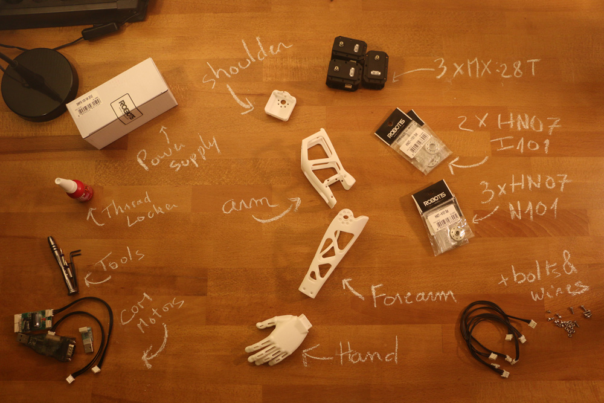

## Bill of Material:

**3D Printed**:
- Hand (left or right)
- Forearm (left or right)
- Upper arm *(displayed arm on picture)*
- Arm connector *(displayed shoulder on picture)*

**Actuators:**
- 3x Robotis Dynamixel MX28-AT (or MX28-T)

**Robotis parts:**
- 3x HN07-N101
- 2x HN07-I101

**Motor configuration:**
- 1x Alimentation 12V
- 1x SMPS2Dynamixel
- 1x USB2Dynamixel or USB2AX
- A computer...
