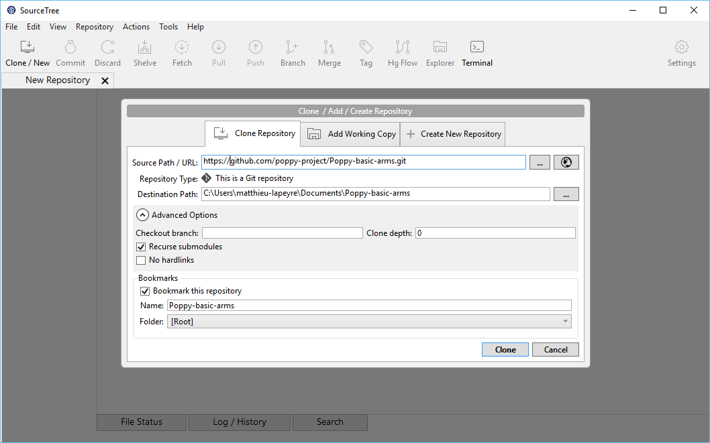
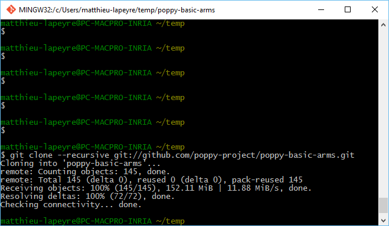

# Cloning this repository

Git and Github are designed for versioning code, using it as a versioning platform for hardware files is a bit out of the scope this tools are made for.

Therefore, we use quite advanced git features such as Submodules and Git LFS.

## Installation

To clone this repository, you need both Git and Git LFS.

1. [Installing Git](https://git-scm.com/book/en/v2/Getting-Started-Installing-Git)
- [Installing GIT LFS](https://help.github.com/articles/installing-git-large-file-storage/#platform-windows)

### [Optional] Install Source Tree

Source Tree is a software providing a nice and easy to use interface for Git. If you are not familiar with Git, it helps a lot understanding what the hell happens.

You can download it [here](https://www.sourcetreeapp.com/)

## Clone this repository

Once you have installed every soft needed, you can "clone" the repository.

### Using Source Tree

Configure your app, then click on the **new repository** button and specify the url of this repository `https://github.com/poppy-project/poppy-basic-arms.git`

If you have forked this project, replace the url by your `https://github.com/YOUR-USERNAME/poppy-basic-arms.git`

### Using the Command line

Open your terminal (or Git Bash on Windows) and tape ` git clone --recursive git://github.com/poppy-project/poppy-basic-arms.git`

This will clone the entire repository including all submodules and download all files.

Again, if you have forked the repository, change the url accordingly.

## Clone the Robotis Library repository

The Poppy arms uses Robotis motors. You've maybe see the robotis model are not here. Actually you have to clone them also.

### Using Source Tree

Same method but this time use the following Source path: `https://github.com/poppy-project/robotis-library.git`

### Using the Command line

Open your terminal (or Git Bash on Windows) and tape ` git clone --recursive git://github.com/poppy-project/robotis-library.git`

## Open the assembly

Now you can open the *humanoid_arm.SLDASM* file and you may have to specify where are the Robotis model. Just indicate the folder in which you have cloned the repository.
