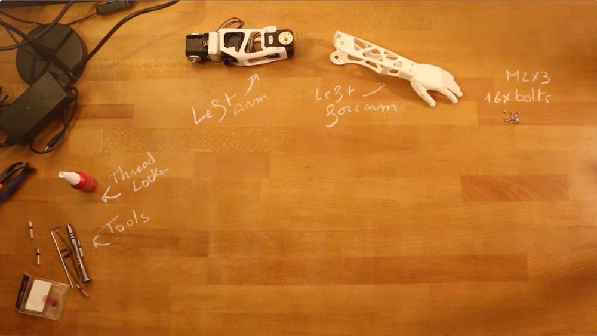

# Left arm assembly instructions

## 1- Build sub-assemblies

First you need to assemble several sub-assemblies which will be combined to create the multi-articulated arm

The following instructions will guide you in this assembly process:

- **1.1- [Left Forearm ](subassemblies/left_forearm_assembly_instructions.md)**
- **1.2- [Left upper arm](subassemblies/left_upper_arm_assembly.md)**
- **1.3- [Left upper-arm/shoulder](subassemblies/left_upper_arm_shoulder_assembly.md)**

## 2- Left arm assembly

- Preparation: 5 min
- Assembly: 5-10 min

### 2.1- Requirement:

**Subassembly**:
- Right upper arm
- Right forearm

**Robotis parts:**
- 16x Bolts M2x3

### 2.2- Assembly instructions:

- **Step 1:** Ensure you have read [**this note**](//github.com/matthieu-lapeyre/Robotis-library/blob/master/doc/robotis_tricks.md) before continuing to avoid the classic (and critical) traps when using Robotis Dynamixel actuators.
- **Step 2**: Click on the image below to display the video:

