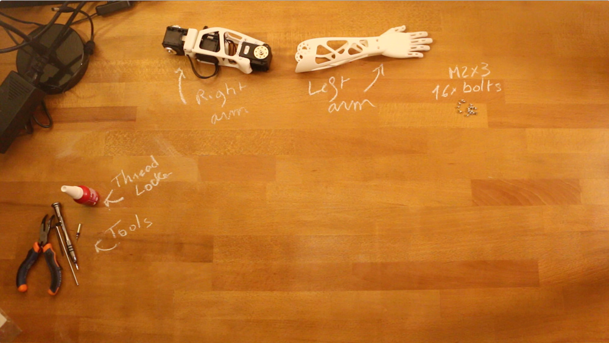

# Right Arm assembly instructions

## 1- Get all components required

First ensure you have all components detailed in the [Bill Of Material](BOM.md).
Also as a friendly reminder, do not forget to use threadlocker otherwise you will see your robot disassemble itself after just few weeks due to vibration.

## 2- Build sub-assemblies

First you need to assemble several sub-assemblies which will be combined to create the multi-articulated arm

The following instructions will guide you in this assembly process:

- **1.1- [Right Forearm ](subassemblies/right_forearm_assembly_instructions.md)**
- **1.2- [Right upper arm](subassemblies/right_upper_arm_assembly.md)**
- **1.3- [Right upper-arm/shoulder](subassemblies/right_upper_arm_shoulder_assembly.md)**

## 3- Right arm assembly

- Preparation: 5 min
- Assembly: 5-10 min

### 3.1- Requirement:

**Subassembly**:
- Right upper arm
- Right forearm *(displayed left arm on picture)*

**Robotis parts:**
- 16x Bolts M2x3

### 3.2- Assembly instructions:

- **Step 1:** Ensure you have read [**this note**](//github.com/poppy-project/Robotis-library/blob/master/doc/en/robotis_tricks.md) before continuing to avoid the classic (and critical) traps when using Robotis Dynamixel actuators.
- **Step 2**: Click on the image below to display the video:

