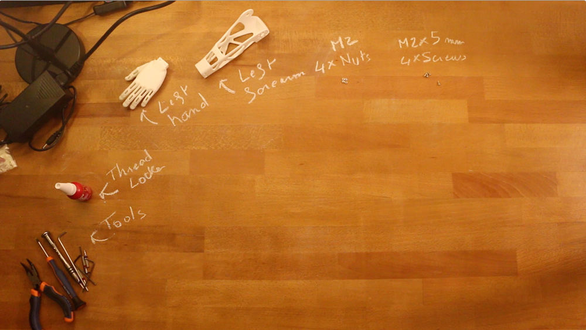

# Left Forearm assembly instructions

- Preparation: 5 min
- Assembly: 5-10 min

## Requirement:

**3D Printed parts**:
- Left hand
- left Forearm

**Robotis parts:**
- 4x Nuts M2
- 4x Screws M2

## Video instructions:
Click on the image below to display the video:

