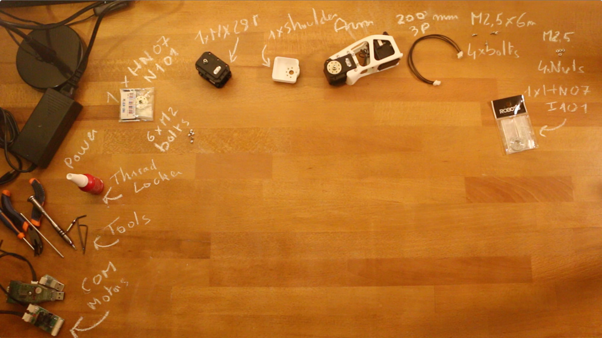

# Left upper-arm/shoulder assembly instructions

- Preparation: 10 min
- Assembly: 15-20 min

## Requirement:

**Subassembly**:
- Left upper arm *(displayed arm on picture)*

**3D Printed parts**:
- arm connector *(displayed shoulder on picture)*

**Actuators:**
- 1x Robotis Dynamixel MX28-AT (or MX28-T)

**Cables**:
- 1x 3P 200mm

**Robotis parts:**
- 1x HN07-N101
- 1x HN07-I101
- 8x Nuts M2.5
- 8x Bolts M2.5x6
- 6x Bolts M2x3

**Motor configuration:**
- 1x Alimentation 12V
- 1x SMPS2Dynamixel
- 1x USB2Dynamixel or USB2AX
- A computer...

## Assembly instructions:

- **Step 1:** Ensure you have read [**this note**](//github.com/matthieu-lapeyre/Robotis-library/blob/master/doc/robotis_tricks.md) before continuing to avoid the classic (and critical) traps when using Robotis Dynamixel actuators.
- **Step 2**: Click on the image below to display the video:

